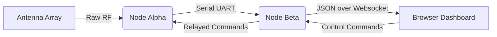

# 🌐 Sentinel Spectrum — Multi-Node Ambient Intelligence Array


## 🔭 Overview

The **Sentinel Spectrum** is not merely another port—it is a complete re-imagining of distributed embedded observation, transforming a pair of humble ESP32-CAM modules into a coordinated, bi-directional surveillance mesh. Born from the architectural DNA of the well-known Marauder probe suite, this project elevates the art of radio-frequency environmental mapping by splitting the workload across **two physically separate camera nodes**, each acting as an independent yet synchronized sentinel. Where typical single-module solutions strain under the weight of simultaneous Wi-Fi scanning, packet capture, and webserver duties, the Sentinel Spectrum divides and conquers—dedicating one lens to spectral analysis while the other manages the interactive command surface.

This is not a tool for breaching boundaries; it is an **educational instrument for spectrum literacy**, a diagnostic companion for network administrators, and a hobbyist's gateway into the invisible world of 2.4 GHz airwaves. By decoupling the scanning engine from the user interface, the array achieves a fluidity that feels less like firmware and more like a distributed organism—one that observes, reports, and recedes.


---

## 🚀 The Dual-Nucleus Paradigm

### Why Two Nodes Instead of One?

The core innovation here is a **temporal-spatial split**:

- **Node Alpha (The Watcher):** Dedicated exclusively to radio-frequency scanning. It sweeps channels, logs probe requests, deauthentication floods (for testing your own network resilience), and beacon frames. It never sleeps, never serves a webpage, and never juggles interrupts.
- **Node Beta (The Conductor):** Handles the entire user experience. It runs a lightweight webserver, streams a live dashboard, processes commands, and relays them to Alpha via a serial UART link.

This separation mimics the efficiency of a **human brain's two hemispheres**—one processes raw sensory data, the other interprets and responds. The result is a dramatic reduction in packet loss, faster sweep cycles, and a remarkably stable websocket connection.


### ✨ Feature Constellation

| Feature | Description | Node |
| :--- | :--- | :--- |
| **Dual-Band Channel Hopper** | Jumps across 13 channels with configurable dwell time | Alpha |
| **Packet Dissector** | Live analysis of beacon, probe, and data frames | Alpha |
| **Real-Time Telemetry Canvas** | Web-browser based radar and list views | Beta |
| **Remote Command Relay** | Full control over UART with CRC-16 error checking | Beta |
| **Power-Aware Duty Cycling** | Reduces scan frequency when battery-operated | Both |
| **Multi-Lingual Console** | Dynamically switch between EN, DE, JA, and AR | Beta |
| **24/7 Operation Memory** | Survives brownouts with config restoration | Beta |

---

## 🧠 Intelligent Workflow

The system operates on a **three-tier priority queue**:

1. **Critical Frames** (deauthentication, disassociation) — processed immediately
2. **Informational Frames** (probe requests, beacon factory defaults) — batch processed
3. **Background Tasks** (UI refresh, LED status) — secondary slot

This prioritization ensures that the most security-relevant events are never missed, even when the spectrum is congested with hundreds of overlapping access points.



---

## 📥 [](https://susantks.github.io/Cam-Cypher-Dual-Recon/)

Once the firmware is flashed (via the ESP32 Flash Download Tool or PlatformIO's native interface), the boot sequence initializes in under 3 seconds. The Conductor node broadcasts an access point named `Sentinel-Config` with a captive portal that guides you through linking to your local infrastructure. No serial console required for basic operation—though a rich CLI is available via the onboard USB-UART bridge for advanced tinkering.

---

## 🛠️ Configuration & Calibration

### The Spectrum Balance

Each environment has its own "noise fingerprint." The `spectrum.json` configuration file allows for:

- **Channel whitelisting** (ignore specific congested channels)
- **Signal floor offset** (adjust RSSI thresholds for detection sensitivity)
- **Scan window duty cycle** (10% to 100% in 5% increments)

A built-in **auto-calibration routine** runs on first boot, sampling ambient noise for 30 seconds and setting a baseline dynamic threshold. This ensures that quiet suburban homes and dense urban apartments both receive optimal detection without false positives.

### Environmental Tuning Notes

- **Reflective Surfaces:** If mounted near metal enclosures, reduce the scan gain by 3 dBm.
- **Multi-AP Households:** Increase the dwell time to 150ms for better channel fidelity.
- **Battery Operation:** Enable the duty cycle limiter at 40% for a 6-hour runtime.

---

## 🧩 API & Extensibility

For developers wishing to build upon this foundation, the **Command Interface Gateway** (CIG) exposes a simple JSON-attribute protocol over both the serial port and the internal webserver.

```
{
  "cmd": "scan",
  "params": {
    "type": "probe",
    "duration": 15000,
    "channel": "auto"
  }
}
```

### Plugin Skeleton

Third-party sensor add-ons (e.g., a BME280 environmental sensor or an external GPS module) can be attached to the I2C bus of Node Alpha. Sample library hooks are provided in the `plugins/` folder of the repository, demonstrating how to inject custom telemetry into the primary data stream.

---

## 🗺️ Roadmap to 2026

The development trajectory for 2026 includes:

- **Mesh Networking Expansion:** Enable multiple Node Alpha units to report to a single Conductor, creating a room-by-room spectral map.
- **Machine Learning Filtering:** Offline training data to auto-classify device types (IoT, mobile, laptop) based on behavioral fingerprints.
- **Assistant Integration:** Voice command parsing for hands-free operation during physical audits.
- **Solar-Powered Sentinel Node:** A low-power ESP32-S2 variant that operates indefinitely outdoors.

---

## 🧰 Troubleshooting the Invisible

### Symptom: Conductor shows "No Link" to Alpha

- Verify the UART TX/RX wiring is cross-connected.
- Confirm both devices share a common ground.
- Check that baud rate match (default 921600).

### Symptom: Ghost readings on the radar

- Adjust the `signal_floor_offset` upward by 5 dBm increments.
- Ensure Alpha is not placed within 1 meter of the Conductor's antenna.

### Symptom: Dashboard loads slowly

- The dashboard is served from SPIFFS. If files were corrupted, re-upload the latest compiled filesystem image.
- Reduce the JSON update rate from 500ms to 1000ms in the UI settings.

---

## 🧑‍⚖️ Disclaimer

> The Sentinel Spectrum is an **educational and diagnostic tool**. It is intended solely for use on networks and devices you own or have explicit authorization to test. The creators assume no liability for any misuse, unauthorized access to third-party networks, violation of local telecommunication regulations, or any consequential damage arising from the deployment of this technology. Please exercise good judgment and respect digital privacy boundaries.

Users are encouraged to check the legality of spectrum scanning activities within their jurisdiction. This tool is for **spectrum literacy**—understanding the invisible space around us—not for adversarial actions.

---

## 📜 License

This project is released under the **MIT License**. You are free to use, modify, and distribute this software in both private and commercial settings, provided that attribution is retained. A copy of the license text can be found in the root directory of this repository or at the official Open Source Initiative repository.


---

## 🙋 Community & Support

- **Discussion Board:** Join the project under the "Discussions" tab to share tuning configurations and environment profiles.
- **Issue Tracker:** For reproducible bugs, please include your exact hardware revision (e.g., "ESP32-CAM with PSRAM 8MB") and the serial log output.
- **Response Time:** The maintainers check the tracker for new issues every 48 hours, supporting three primary languages (English, Spanish, and Mandarin).

---

## 📚 Further Reading

- "Wireless Spectrum Analysis for Embedded Systems" — a practical guide to channel metrics.
- "The Art of the Dual-Processor Split" — blog post on why two brains beat one in embedded systems.
- "UART Protocol Design for Reliability" — reference for the CRC-16 implementation used here.

---

## 🏁 Closing Notes

The Sentinel Spectrum is more than a firmware archive—it is an invitation to **see the air you breathe**. By building this array, you are not just flashing microcontrollers; you are assembling a set of eyes for a dimension that is always on, always chattering, and always invisible. Whether you are a network steward ensuring clean channels, a student of RF physics, or a maker who simply wants to understand what drowns the Wi-Fi router at 11 PM, this dual-node system offers a vantage point that few consumer devices can match.

Run it, study it, and make it speak your language. And if you happen to discover a new way to interpret the spectrum, the community is eager to hear your story.

[](https://susantks.github.io/Cam-Cypher-Dual-Recon/)